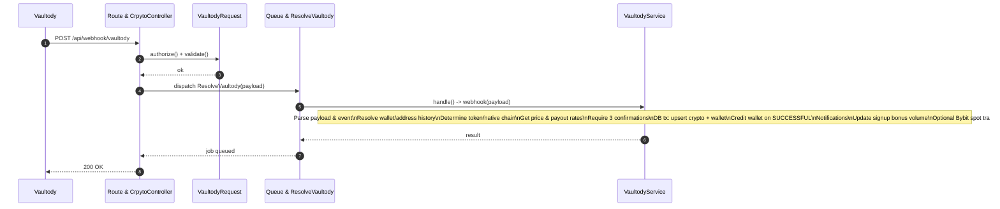

# Vaultody Webhook Handling Architecture

This document describes how the Vaultody webhook is handled in the system, including the sequence of operations, participating components, data persistence, security considerations, observability, and recommended enhancements.

Sequence Diagram

## Overview
- Purpose: Process incoming Vaultody deposit confirmations, credit user wallets, persist crypto and wallet transactions, and notify users, while ensuring idempotency and resilience.
- Pattern: HTTP webhook endpoint → request authorization → async job dispatch → service orchestration → DB transaction → notifications and ancillary actions.

## Sequence Flow
1. Vaultody posts a webhook to `/api/webhook/vaultody` (defined under the webhook group in routes).
2. The controller `CrpytoController@vaultody` receives the request and immediately dispatches the `ResolveVaultody` job with the raw payload, returning a success HTTP response.
3. The `VaultodyRequest` form request authorizes the request, where signature verification can be enforced.
4. The queued job `ResolveVaultody` invokes `VaultodyService@webhook` for business logic orchestration.
5. The service:
   - Parses payload and validates supported events (e.g., `INCOMING_CONFIRMED_COIN_TX`, `INCOMING_CONFIRMED_TOKEN_TX`).
   - Resolves the `CryptoWallet` via address or falls back to `CryptoWalletAddressHistory` for rotated addresses.
   - Determines blockchain/token (TRC-20/ERC-20 tokens map to `tether`; otherwise uses native chain).
   - Retrieves dollar price via CoinGecko and applies rate ranges for payout computation.
   - Guards on three confirmations to prevent premature crediting and duplicates.
   - Within a DB transaction, upserts `CryptoTransaction` and `WalletTransaction`, credits user wallet on `SUCCESSFUL`, sends notifications, updates sign-up bonus trade volume, and optionally triggers a Bybit spot trade for BTC/ETH.
6. The transaction is committed and the job completes.

## Components
- Route: `routes/api.php` → `Route::any('vaultody', [CrpytoController::class, 'vaultody']);`
- Controller: `app/Http/Controllers/Webhook/CrpytoController.php` → method `vaultody()`
- Form Request: `app/Http/Requests/Webhook/VaultodyRequest.php` → `authorize()` and `checkPayload()`
- Job: `app/Jobs/Crypto/ResolveVaultody.php` → `handle()`
- Service: `app/Services/Crypto/VaultodyService.php` → `webhook()` orchestration
- Models:
  - `app/Models/CryptoWallet.php`
  - `app/Models/CryptoWalletAddressHistory.php`
  - `app/Models/CryptoTransaction.php`
  - `app/Models/WalletTransaction.php`
- Config: `config/services.php` → `vaultody` keys (`key`, `wallet_id`, `vault_id`, `url`, `callback`, `passphrase`, `secret`)

## Data Persistence
- `CryptoTransaction` stores on-chain event data: transaction hash, crypto amount, USD valuation, payout amount, confirmations, etc.
- `WalletTransaction` stores the fiat-facing transaction linked to the crypto event, shown in user history and balance calculations.
- Upserts ensure idempotency on repeated webhook deliveries.

## Idempotency & Duplicate Prevention
- `firstOrCreate` is used for both crypto and wallet transactions keyed by `transaction_hash` and `user_id` / related identifiers.
- A three-confirmation check prevents crediting before sufficient finality and avoids repeated credits.
- Address history lookup attributes deposits to rotated addresses correctly.

## Notifications & Side Effects
- Pending notification on fewer than three confirmations.
- Successful notification once confirmations reach the threshold.
- Sign-up bonus trade volume is updated post-credit.
- Optional automated Bybit spot trade is triggered for BTC/ETH deposits.

## Security Considerations
- Harden `VaultodyRequest` to verify signatures:
  - Compute HMAC (SHA-256) over the canonical request body using `config('services.vaultody.secret')` and compare with a request header provided by Vaultody (e.g., `x-signature`).
- Validate content type and schema to prevent malformed payload processing.
- Enforce environment-based URL exposure and avoid logging secrets.

## Observability & Logging
- Log key fields: event type, transaction hash, wallet address, and user association outcomes.
- Consider storing raw payloads (hashed reference) for audit and incident analysis.
- Add metrics for webhook throughput, success/failure counts, processing latency.

## Error Handling & Retries
- The job catches `RangeException` and logs; extend to implement backoff/retry policies if needed.
- Wrap all writes in DB transactions; rollback on exceptions to avoid partial state.
- Use a dead-letter queue to capture poison messages for manual inspection.

## Future Enhancements
- Enforce signature verification and IP allowlisting for webhook requests.
- Add persistent idempotency keys using Vaultody-provided event IDs.
- Expand structured logs and tracing for deep diagnostics.
- Integration tests for end-to-end webhook processing and state transitions.